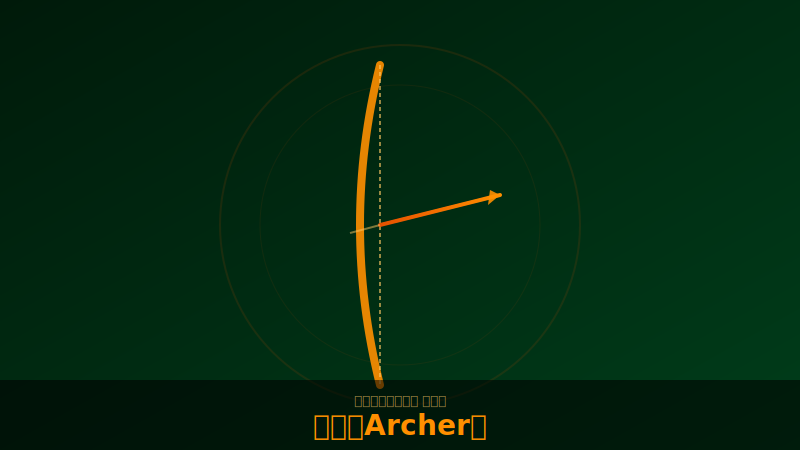

# 弓取（Archer）

  

!!! note "画像について"
    キャラクター・スキルのスクリーンショットをお持ちの方は [GitHub](https://github.com/jtkjp06/yotei-legends-wiki) でPRをお送りください。

## 基本情報

| 項目 | 内容 |
|------|------|
| フォーカス武器 | 槍（Yari） |
| 奥義 | 内経の眼（ロックオン複数射撃） |
| 役割 | 遠距離殲滅・エリート処理 |

## 特徴

- ヘッドショット精度が全ての職人キャラ
- 神品「水切の長弓」入手で世界が変わる（HSで近くの敵に反射）
- 長弓は引き絞りの有無でダメージが変わらない（パシャ撃ちが有効）（5ch実測）
- 格上がると「HSで矢消費なし」が解放され弾切れ問題が解消

!!! danger "3/14アプデでナーフ"
    True Aim Yumi（必中の長弓）の奥義ゲイン獲得量が大幅に弱体化。
    それでも長弓火力自体は十分高いまま。（5ch実測・パッチノート）

## 弾薬管理の重要性

- **飛び道具補給は全員共有リソース**（5ch実測。前作は個別だった）
- 長弓は10本しかない。序盤は近接で節約し、終盤のエリート大群に火力を集中
- 弓取がいる場合、他クラスは弾薬を譲るのが基本マナー（ただし強制ではない）

## 九死での注意

- 高台から撃つだけで陣地に降りない弓取は地雷扱いされる
- 陣地防衛時間が極端に短い＝チームの足を引っ張っている
- 蘇生も重要な仕事。目潰し玉で安全に蘇生できる

## 装備方針

<!-- TODO: 具体的なビルド例を追記 -->

- 奥義回復を全装備に盛る → 内経の眼の回転率が段違いに
- 半弓（サブ）はオートエイム付きの名品が便利
- 撒菱で弾薬ドロップを確保する構成もあり
