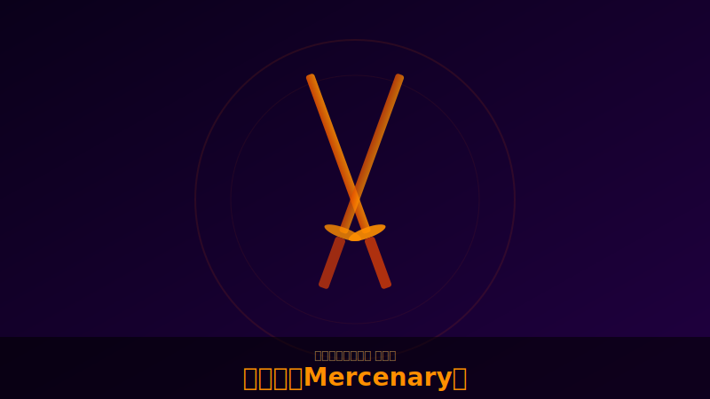

# 用心棒（Mercenary）

  

!!! note "画像について"
    キャラクター・スキルのスクリーンショットをお持ちの方は [GitHub](https://github.com/jtkjp06/yotei-legends-wiki) でPRをお送りください。

## 基本情報

| 項目 | 内容 |
|------|------|
| フォーカス武器 | 二刀（Dual Katanas） |
| 奥義 | 狼召喚などの報告あり（要詳細確認）[（5ch報告）](../sources/5ch-threads.md) |
| 役割 | サポート火力・デバフばらまき |

## 特徴

- 武器生成から投げデバフの連携が核。投げ物で確定怯み＋それなりのダメージ[（5ch報告）](../sources/5ch-threads.md)
- 「拾った武器」にもデバフ効果が乗るため援護性能が高い[（5ch報告）](../sources/5ch-threads.md)
- 格35あたりまではトドメクールダウン短縮で無双できるが、高難度では火力不足を感じる場面も
- 牢人のような全体蘇生や回復エリア生成スキルの代わりとして「**癒しの香**」効果を持つ煙玉を装備可能[（5ch報告）](../sources/5ch-threads.md)

## パッシブシナジー

以下のパッシブが噛み合うと投げ物特化ビルドが成立：

- 範囲弱体化
- 投げ物威力+25%
- 投げ物キルで兵具クールダウン短縮
- 固有技と奥義で投げ物生成 → 回転率UP

## 装備方針

<!-- TODO: 具体的なビルド例を追記 -->

- 投げ物ダメージは全武具で盛れる模様[（5ch報告）](../sources/5ch-threads.md)
- 種子島は本来のドロップ守備範囲外（ほぼ落ちない）
- 撒菱＋種子島で遠距離火力を確保する構成も

## 九死での立ち回り

- 2人で陣地を守る時のサポートが本領
- 武器投げデバフで敵を弱体化 → 味方が仕留める連携
- 単独で陣地を守るのは火力的にきつい場面がある

---

## ソース

- [goylegends.com](https://goylegends.com/)
- [5chスレ Part1](https://pug.5ch.io/test/read.cgi/famicom/1772260586/)
- PS公式
