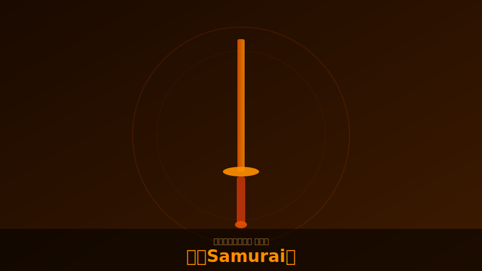

# 侍（Samurai）

  

!!! note "画像について"
    キャラクター・スキルのスクリーンショットをお持ちの方は [GitHub](https://github.com/jtkjp06/yotei-legends-wiki) でPRをお送りください。

## 基本情報

| 項目 | 内容 |
|------|------|
| フォーカス武器 | 大太刀（Odachi） |
| 奥義 | 八幡の怒り（範囲近接攻撃） |
| 役割 | 前線維持・範囲火力 |

## 特徴

- 大太刀のリーチと火力で前線を維持するタンク＆DPS
- 八幡の怒りは九死ラストウェーブの切り札。奥義ダメージを盛らないと火力不足（5ch実測）
- 大太刀の「斬り返しの極意」が棒火矢兵に有効（5ch実測）
- 焔の剣（炎エンチャント）が強力

## 装備方針

<!-- TODO: 具体的なビルド例を追記 -->

- 奥義ダメージUP は必須。盛らないと八幡がゴミになる
- 近接ダメージUP との両立が理想
- 気合酒（神品）との相性が良い（気力→奥義の回転率UP）

## 九死での立ち回り

- 前線で穴埋め。味方の蘇生ラインを維持することが最重要
- 八幡の怒りはラストウェーブまで温存する判断も必要
- 大太刀は剛兵に対して特攻判定あり

!!! warning "開幕武器について"
    開幕は必ず大太刀を持った状態で始まる。二刀スタートにする設定は現状なし。（5ch実測）
