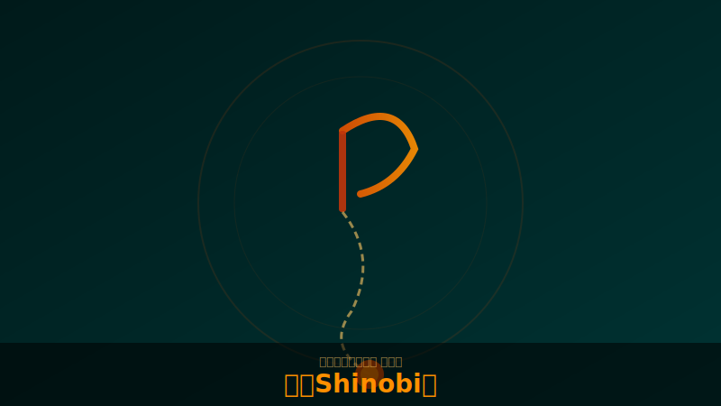

# 忍（Shinobi）

!!! note "画像について"
    キャラクター・スキルのスクリーンショットをお持ちの方は [GitHub](https://github.com/jtkjp06/yotei-legends-wiki) でPRをお送りください。

## 基本情報

| 項目 | 内容 |
|------|------|
| フォーカス武器 | 鎖鎌（Kusarigama） |
| 奥義 | 闇烏[（5ch報告）](../sources/5ch-threads.md) |
| 役割 | 暗殺・ギミック処理 |

## 特徴

- 鎖鎌のぶん回しがマルチでは意外と強い。敵のガードが本編より緩いため[（5ch報告）](../sources/5ch-threads.md)
- 精霊剥がしにも鎖鎌が便利
- 分身スキルあり（闇討ち→分身生成）。ヘイト分散に有効
- **育つまでが弱い**。格を上げて能力解放していくことが特に重要[（5ch・YouTube検証報告）](../sources/5ch-threads.md)
- 今作では気力と奥義ゲージが別枠になっており、闇烏の連続発動は工夫次第で可能との報告あり[（5ch報告）](../sources/5ch-threads.md)

!!! info "3/14アプデ"
    忍のマスク（頭巾）がバグで外せなかった問題が修正。
    デフォルトがスキンヘッドになり、頭巾は装具扱いに。

## 鎖鎌のテクニック

- ダッシュ→□→○ループで高速移動[（5ch報告）](../sources/5ch-threads.md)
- 刀に切り替え時の△突きがガード不能＋よろめきダメージ大
- 精霊付きの敵は鎖鎌で剥がしてから本体を殴る

## 装備方針

<!-- TODO: 具体的なビルド例を追記 -->

- 神品「鎖鎌 隠」：気力技で倒すと霧隠れ発動
- 神品「Shinobi's Shadow」：霧隠れ中の闇討ちで再発動（二連と重複）
- 煙玉に目潰し効果を乗せてからの「目潰し玉→闇討ち」の連続コンボが極めて強力[（5ch報告）](../sources/5ch-threads.md)

---

## ソース

- [goylegends.com](https://goylegends.com/)
- PS公式 — PlayStation Blog 2026/02/13
- [5chスレ Part1](https://pug.5ch.io/test/read.cgi/famicom/1772260586/)（>>278, >>375, >>403 等の難易度・推奨気に関する報告）
- [5chスレ Part2](https://pug.5ch.io/test/read.cgi/famicom/1773502432/)
- [5chスレ Part3](https://pug.5ch.io/test/read.cgi/famicom/1774067069/)
- [YouTube検証・構築例](../sources/youtube.md)