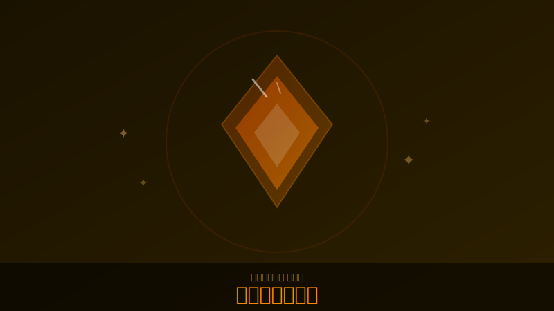

# 神品（レジェンダリー）一覧

  

!!! note "画像について"
    神品の外観スクリーンショットをお持ちの方は [GitHub](https://github.com/jtkjp06/yotei-legends-wiki) でPRをお送りください。

!!! info "情報源"
    goylegends.com の一覧をベースに、5chスレの実測効果を追記。
    固有効果欄の「要検証」は未確認情報。
    全装備の一覧は[ドロップアイテム一覧](drops.md)を参照。

## 近接武器

| 名前 | スロット | 対応クラス | 固有効果 |
|------|---------|-----------|---------|
| 轟雷刀 (Thunderous Katana) | 片刃刀 | 汎用 | 気力技使用時に30%で付近の敵吹き飛ばし |
| 轟雷槍 (Thunderous Yari) | 槍 | 弓取 | 気力技の後に爆発、付近の敵弱体化 |
| 稲妻打 (Lightning's Bite) | 二刀 | 用心棒 | 気力技の最後に高威力の炎上爆発（比較的近距離、確率100%ではない模様）[（5ch報告）](../sources/5ch-threads.md) |
| 巌の大太刀 (Blade of Mountains) | 大太刀 | 侍 | 気力技ヒット時に体力回復 |
| 鎖鎌 隠 (Vanishing Kusarigama) | 鎖鎌 | 忍 | 気力技で倒すと霧隠れになる |

## 遠距離武器

| 名前 | スロット | 固有効果 |
|------|---------|---------|
| 半弓 風巻 (Hurricane Hankyu) | 半弓 | 2倍連射・照準不可・脆弱付与 |
| 水切の長弓 (Skipping Stone Bow) | 和弓 | HSで近くの敵に反射 |
| 必中の長弓 (True Aim Yumi) | 和弓 | ロックオンして矢を3本同時射出 ※3/14ナーフ済み |
| 種子島 早合 (Lightning Tanegashima) | 種子島 | HSかトドメで即座に装填。弓取のHS弾消費なしが適用される[（5ch報告）](../sources/5ch-threads.md) |

## ゴースト武器

| 名前 | スロット | 固有効果 |
|------|---------|---------|
| 鬼火の放心玉 (Vengeful Onibi Bomb) | 放心玉 | 爆発範囲内に鬼火発生 |
| 目潰し玉 癒 (Healing Blind Bomb) | 目潰し玉 | 味方を回復 |
| 光の苦無 (Spirit Kunai) | 苦無 | 敵を倒すと全クールダウン10秒短縮 |
| 単筒 嵐 (Storm Tanzutsu) | 短筒 | 装弾数6、連射可、ダメージ30%減 |
| 幻惑の目潰し (Hallucinating Metsubushi) | 目潰し | 混乱付与 |
| 活力の香 (Purified Healing Incense) | 癒し線香 | 体力と気力を持続回復 |
| 煙玉 弱体 (Weakening Smoke Bomb) | 煙玉 | 弱体付与 |
| 撒き菱 苦難 (Affliction Caltrops) | 撒菱 | 毒・脆弱・弱体・出血付与 |

## お守り（チャーム）

| 名前 | 種別 | 固有効果 |
|------|------|---------|
| 気合酒 (Spirit Brew) | 汎用 | 気力を2得る <!-- TODO: 発動条件確認 --> |
| 調和の鐘 (Harmonious Bell) | 汎用 | 癒しの鐘を鳴らすと全員回復＆蘇生 |
| 受け流しの極意 (Risky Parry) | 汎用 | 通常の受け流し不可。極意の反撃が3連撃に |
| 侍の籠手 (Samurai's Bracer) | 侍専用 | <!-- TODO: 効果確認 --> |
| 弓取の備え (Archer's Supply) | 弓取専用 | <!-- TODO: 効果確認 --> |
| 用心棒の相棒 (Mercenary's Best Friend) | 用心棒専用 | <!-- TODO: 効果確認 --> |
| 忍の影 (Shinobi's Shadow) | 忍専用 | 霧隠れ中の闇討ちで再発動（二連と重複） |

**確認済み全24件**（WIPにつき増える可能性あり）

---

## ソース

- [goylegends.com](https://goylegends.com/)
- [5chスレ Part1](https://pug.5ch.io/test/read.cgi/famicom/1772260586/)
- [5chスレ Part2](https://pug.5ch.io/test/read.cgi/famicom/1773502432/)
- [5chスレ Part3](https://pug.5ch.io/test/read.cgi/famicom/1774067069/)
- PS公式
- [YouTube検証・構築例](../sources/youtube.md)
